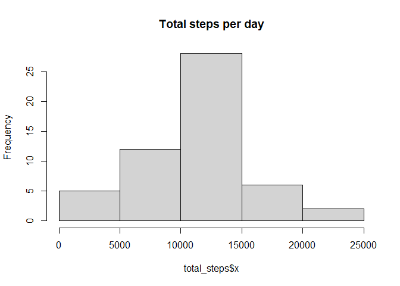
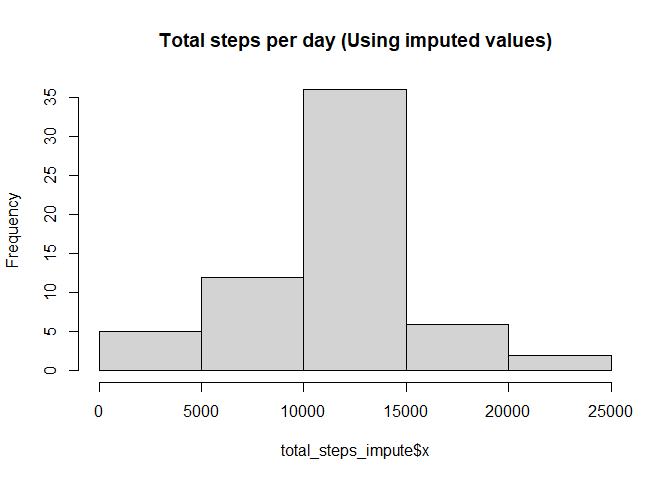
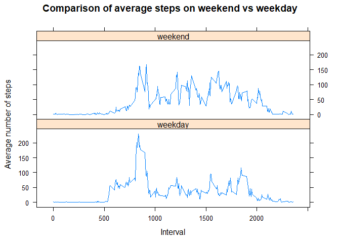

## Loading and preprocessing the data


```r
if (!file.exists("./activity.csv")) {
    message("Unzipping")
    unzip("./activity.zip", overwrite = FALSE)
}

activity_df <- read.csv("activity.csv")

library(lubridate)
```

```
## 
## Attaching package: 'lubridate'
```

```
## The following objects are masked from 'package:base':
## 
##     date, intersect, setdiff, union
```

```r
activity_df$date <- ymd(activity_df$date)
```


## What is mean total number of steps taken per day?


```r
library(tidyverse)
```

```
## Warning: package 'tidyverse' was built under R version 4.0.4
```

```
## -- Attaching packages --------------------------------------- tidyverse 1.3.0 --
```

```
## v ggplot2 3.3.3     v purrr   0.3.4
## v tibble  3.0.5     v dplyr   1.0.3
## v tidyr   1.1.2     v stringr 1.4.0
## v readr   1.4.0     v forcats 0.5.1
```

```
## -- Conflicts ------------------------------------------ tidyverse_conflicts() --
## x lubridate::as.difftime() masks base::as.difftime()
## x lubridate::date()        masks base::date()
## x dplyr::filter()          masks stats::filter()
## x lubridate::intersect()   masks base::intersect()
## x dplyr::lag()             masks stats::lag()
## x lubridate::setdiff()     masks base::setdiff()
## x lubridate::union()       masks base::union()
```

```r
total_steps <- aggregate(activity_df$steps,by=list(Date=activity_df$date), FUN="sum")
total_steps <- total_steps %>% drop_na(x)

hist(total_steps$x, main = "Total steps per day")
```

<!-- -->

Mean of the total number of steps taken per day: 1.0766189\times 10^{4}.


Median of the total number of steps taken per day: 10765.


## What is the average daily activity pattern?


```r
daily_pattern <- aggregate(activity_df$steps, by=list(Interval=activity_df$interval), na.rm=TRUE, FUN="mean")
plot(daily_pattern, type = "l", ylab="Average Steps")
```

<!-- -->

The 5-minute interval, 835, contains the maximum number of steps.

## Imputing missing values

The total number of missing values in the dataset is 2304.


```r
imputed_df <- activity_df

# Imputing by getting the mean for the 5-minute interval
# I feel that there is a more efficient/elegant solution but I spent a while
# trying to find it but was hitting a road block... =/
for(index in 1:nrow(activity_df)) {
    if (is.na(activity_df$steps[index])) {
        imputed_df$steps[index] <- daily_pattern$x[which(daily_pattern$Interval == activity_df$interval[index])]
    } 
}

total_steps_impute <- aggregate(imputed_df$steps,by=list(Date=imputed_df$date), FUN="sum")
hist(total_steps_impute$x, main = "Total steps per day (Using imputed values)")
```

<!-- -->

Mean of the total number of steps taken per day (using imputed data): 1.0766189\times 10^{4}.


Median of the total number of steps taken per day (using imputed data): 1.0766189\times 10^{4}.


Do these values differ from the estimates from the first part of the assignment? What is the impact of imputing missing data on the estimates of the total daily number of steps?

The answer to these questions is that the mean of the total number of steps per day is the same but the median has changed when imputing the values. The estimates of the mean/median are still similar and have not deviated much.

## Are there differences in activity patterns between weekdays and weekends?


```r
weekdays_list <- c('Monday', 'Tuesday', 'Wednesday', 'Thursday', 'Friday')
imputed_df$wDay <- c('weekend', 'weekday')[(weekdays(imputed_df$date) %in% weekdays_list)+1L]

average_steps_week <- aggregate(steps ~ wDay + interval,data=imputed_df, FUN="mean")

library(lattice)

xyplot(steps ~ interval | wDay, average_steps_week, type="l", layout=c(1,2), 
       main="Comparison of average steps on weekend vs weekday",
       ylab="Average number of steps",
       xlab="Interval")
```

<!-- -->

